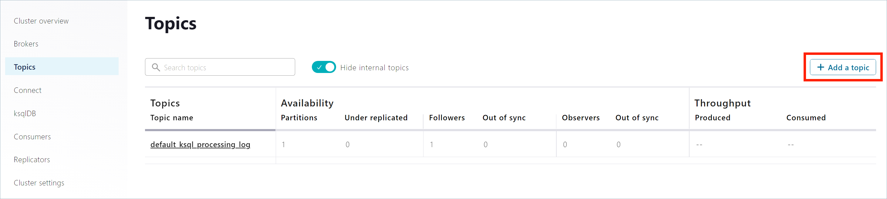

A fast and light-weight reverse proxy with embedded gateway to wrap third party APIs and bring them to the ecosystem of light-4j frameworks

[Stack Overflow](https://stackoverflow.com/questions/tagged/light-4j) |
[Google Group](https://groups.google.com/forum/#!forum/light-4j) |
[Gitter Chat](https://gitter.im/networknt/light-proxy) |
[Subreddit](https://www.reddit.com/r/lightapi/) |
[Youtube Channel](https://www.youtube.com/channel/UCHCRMWJVXw8iB7zKxF55Byw) |
[Documentation](https://doc.networknt.com/service/proxy/) |
[Contribution Guide](https://doc.networknt.com/contribute/) |

[](https://travis-ci.org/networknt/light-proxy)

## Why Reverse Proxy

All the services developed on top of light-4j frameworks support [client side service discovery](http://microservices.io/patterns/client-side-discovery.html), 
load balance and cluster natively. So there is no need to put a reverse proxy instance in front of our
services like other API frameworks that support only [server side service discovery](http://microservices.io/patterns/server-side-discovery.html).

Also, light services embed a distributed gateway to address all the cross-cutting concerns in the 
request/response chain and work with the ecosystem that consists:

* [light-oauth2](https://doc.networknt.com/service/oauth/) for security
* [light-portal](https://github.com/networknt/light-portal) for API management and market place
* [light-config-server](https://github.com/networknt/light-config-server) for centralized configuration management
* [light-eventuate-4j](https://doc.networknt.com/style/light-eventuate-4j/) for eventual consistency based on event sourcing, CQRS and Kafka
* [ELK](https://www.elastic.co/webinars/introduction-elk-stack) for centralized logging with traceabilityId and correlationId
* [InfluxDB](https://github.com/influxdata/influxdb) and [Grafana](https://github.com/grafana/grafana) for metrics
* [Consul](https://github.com/hashicorp/consul) or [Zookeeper](http://zookeeper.apache.org/) for service registry
* [Kubernetes](https://kubernetes.io/) for container orchestration

Currently, we only support Java language; however, we are planning to support Nodejs and Go in the future
if there are enough customer demands. For some of our customers, they have some existing RESTful APIs that
built on top of other Java frameworks or other languages. We've been asked frequently on how to interact
with these services to/from light services and how to enable security, metrics, logging, discovery, 
validation, sanitization etc. on the existing services. 

Our answer is to deploy a reverse proxy built on top of light-4j framework that wraps the existing service. 

The reverse proxy has the following features:

* High throughput, low latency and small footprint. 
* Integrate light-oauth2 to protect un-secured services
* Built-in load balancer
* Can be started with Docker or standalone
* Support HTTP 2.0 protocol on both in/out connections
* TLS termination
* Support REST, GraphQL and RPC style of APIs
* Centralized logging with ELK, traceabilityId and CorrelationId
* Collect client and service metrics into InfluxDB and view the dashboard on Grafana
* Service registry and discovery with Consul or Zookeeper
* Manage configuration with light-config-server

## Local environment test.

kafka sidecar normally is used for deploying as a separate sidecar container for kubernetes cluster. But we still can verify it locally.

Click [here](https://doc.networknt.com/tutorial/kafka-sidecar/local-dev/#reactive-consumer) for local test detil.

If the evnironment is windows OS, we can start confluent kafka docker-compose for testing:

From command line, create a docker network first which will indicate kafka and sidecar running in same network. 

```
cd kafka-sidecar

docker network create localnet

docker-compose up -d
```

---

The above command starts Confluent Platform with a separate container for each Confluent Platform component. Your output should resemble the following:

```text
Creating network "cp-all-in-one_default" with the default driver
Creating zookeeper ... done
Creating broker    ... done
Creating schema-registry ... done
Creating rest-proxy      ... done
Creating connect         ... done
Creating ksql-datagen    ... done
Creating ksqldb-server   ... done
Creating control-center  ... done
Creating ksqldb-cli      ... done
```

To verify that the services are up and running, run the following command:

```text
docker-compose ps
```
Your output should resemble the following:

```text
     Name                    Command               State                Ports
------------------------------------------------------------------------------------------
broker            /etc/confluent/docker/run        Up      0.0.0.0:29092->29092/tcp,
                                                           0.0.0.0:9092->9092/tcp
connect           /etc/confluent/docker/run        Up      0.0.0.0:8083->8083/tcp,
                                                           9092/tcp
control-center    /etc/confluent/docker/run        Up      0.0.0.0:9021->9021/tcp
ksqldb-cli        /bin/sh                          Up
ksql-datagen      bash -c echo Waiting for K ...   Up
ksqldb-server     /etc/confluent/docker/run        Up      0.0.0.0:8088->8088/tcp
rest-proxy        /etc/confluent/docker/run        Up      0.0.0.0:8082->8082/tcp
schema-registry   /etc/confluent/docker/run        Up      0.0.0.0:8081->8081/tcp
zookeeper         /etc/confluent/docker/run        Up      0.0.0.0:2181->2181/tcp,
                                                           2888/tcp, 3888/tcp
```

Now we can Navigate to the Control Center web interface to verify:

http://localhost:9021.

---

### Verify kafka sidecar  with local kafka:

1. Navigate to the Control Center web interface (http://localhost:9021),in the navigation bar, click Topics to open the topics list, and then click Add a topic.



Create a topic "test1" and client the topic add register the topic schema:

key schema:

```json
{
  "$id": "http://example.com/myURI.schema.json",
  "$schema": "http://json-schema.org/draft-07/schema#",
  "additionalProperties": false,
  "description": "Sample schema to help you get started.",
  "title": "key_test1",
  "type": "string"
}
```
value schema:

```json
{
  "$id": "http://example.com/myURI.schema.json",
  "$schema": "http://json-schema.org/draft-07/schema#",
  "additionalProperties": false,
  "description": "Sample schema to help you get started.",
  "properties": {
    "count": {
      "description": "The integer type is used for integral numbers.",
      "type": "integer"
    }
  },
  "title": "value_test1",
  "type": "object"
}
```

2. Start kafka sidecar and backend api:

There are two options for starting kafka sidecar and backend api:

- by standalone APIs
  
- by docker-compose
----
#### By docker-compose

Start kafka sidecar and backend api docker compose:

```text

docker-compose -f docker-compose-demo.yml up
```

It will start kafka sidecar and backend api by using config in the config/docker folder

Notes: this is API docker container to kafka docker container, if you need change kafka lisener ports, please [refer](https://github.com/bitnami/bitnami-docker-kafka/blob/master/README.md#accessing-kafka-with-internal-and-external-clients) here


#### By standalone APIs

Or start kafka sidecar from IDE with VM options:

-Dlight-4j-config-dir=config\local

Start Backend service (optional, we can still test connect without backend service)

Start below the backend API from IDE:

https://github.com/networknt/light-example-4j/tree/release/kafka/sidecar-backend

----

3. Produce messages to the test1 topic

To produce some messages to the test1 topic, we can issue a curl command.

```json
curl --location --request POST 'http://localhost:8084/producers/test1' \
--header 'X-Traceability-Id: 111111' \
--header 'Content-Type: application/json' \
--data-raw '{
    "records": [
        {
            "key": "alice",
            "value": {
                "count": 2
            }
        },
        {
            "key": "john",
            "value": {
                "count": 1
            }
        },
        {
            "key": "alex",
            "value": {
                "count": 2
            }
        }
    ]
}'
```

4. Verify the message in kafka test1 topic


5. Check the log, and we can see the result from backend API call:

```text
16:25:08.075 [XNIO-1 task-1]  mXFjPCfGSMiYfq_F3YrXSw INFO  c.s.e.e.m.k.h.ProducersTopicPostHandler:154 handleRequest - ProducerTopicPostHandler handleRequest start with topic test1
16:25:09.851 [pool-3-thread-1]   INFO  c.s.e.e.m.k.ReactiveConsumerStartupHook$1:172 onCompletion - Send a batch to the backend API
16:25:09.868 [pool-3-thread-1]   INFO  c.s.e.e.m.k.ReactiveConsumerStartupHook$1:186 onCompletion - Got successful response from the backend API
```


### Verify Reactive Consumer Dead Letter Queue (DLQ) feature:

Reactive Consumer can set DLQ for those messgage process failed. The default DLQ name is the topic name + ".dlq". For our local test case, we can add a DQL: test1.dlq on kafka control center.

And the enable DLQ on local_config/values.yml:

```text
kafka-consumer.deadLetterEnabled: true
```

In the backend-api, the first event for each message will mark as process failed:

```text
 RecordProcessedResult rpr = new RecordProcessedResult(record, false, sw.toString());
```

The Reactive Consumer will send those message to DLQ if deadLetterEnabled.

### Using the sidecar endpoint to producer error message to DLQ:

- endpoint: 

  /consumers/deadLetter/active

- method
  
   POST

Sample request payload:

```json
[
    {
        "record": {
            "topic": "test6",
            "key": "YWxleA==",
            "value": "xyz",
            "partition": 0,
            "offset": 0
        },
        "processed": false,
        "stacktrace": "error happened",
        "correlationId": "cccc-1111111",
        "traceabilityId": "tttt-1111111",
        "key": "YWxleA=="
    },
        {
        "record": {
            "topic": "test7",
            "key": "YWxleA==",
            "value": "xyz",
            "partition": 0,
            "offset": 0
        },
        "processed": false,
        "stacktrace": "error happened",
        "correlationId": "cccc-1111111",
        "traceabilityId": "tttt-1111111",
        "key": "YWxleA=="
    }
]
```

### Verify KsqlDB query:

[ksqlDB query](doc/ksql.md)


### Active Consumer Workflow:

Kafka sidecar provide the end-to-end workflow for actively consumer the records from kafka topic(s).  

When user try  following workflow to consumer records:

- enable ActiveConsumerStartupHook on service.yml (or values.yml)
  
   This will create kafka consumer manager for active consumer on kafka sidecar server startup


-  create consumer group
   
    endpoint: /consumers/{group}
 
    method: POST


-  subscribe the topics for consumer group created above

   endpoint: /consumers/{group}/instances/{instance}/subscriptions

   method: POST


- consumer records from kafka topics subscribed above (default will start from 0 offset, user move the offset by calling different endpoints)

  endpoint: /consumers/{group}/instances/{instance}/records

  method: GET


- submit offset after consumer

  endpoint: /consumers/{group}/instances/{instance}/offsets

  method: POST


- add the records process detail to audit 

  endpoint: /consumers/active/audit

  method: POST

### To learn how to use this proxy, pleases refer to 

* [Getting Started](https://doc.networknt.com/getting-started/light-proxy/) to learn core concepts
* [Tutorial](https://doc.networknt.com/tutorial/proxy/) with step by step guide for RESTful proxy
* [Configuration](https://doc.networknt.com/service/proxy/configuration/) for different configurations based on your situations
* [Artifact](https://doc.networknt.com/service/proxy/artifact/) to guide customer to choose the right artifact to deploy light-proxy.

